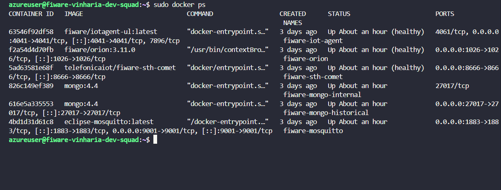
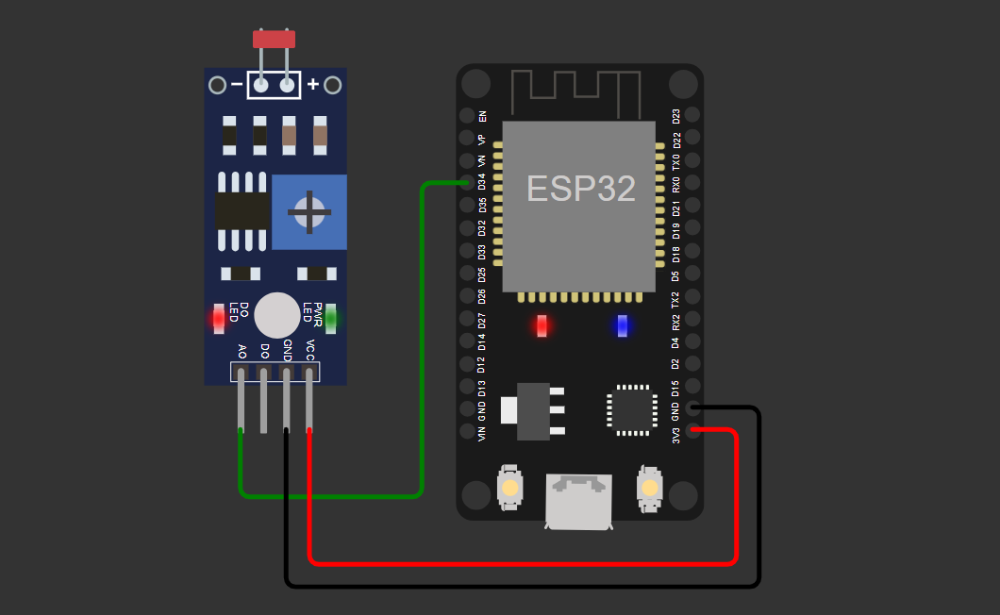
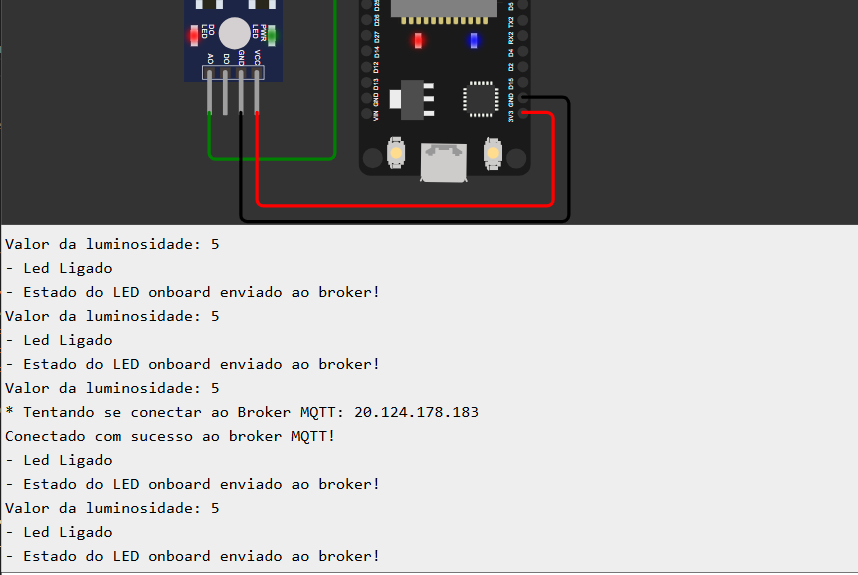
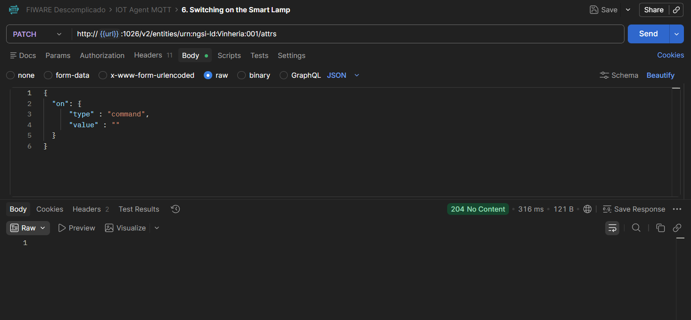
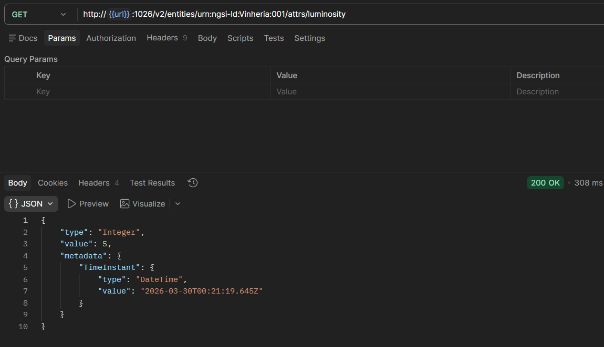
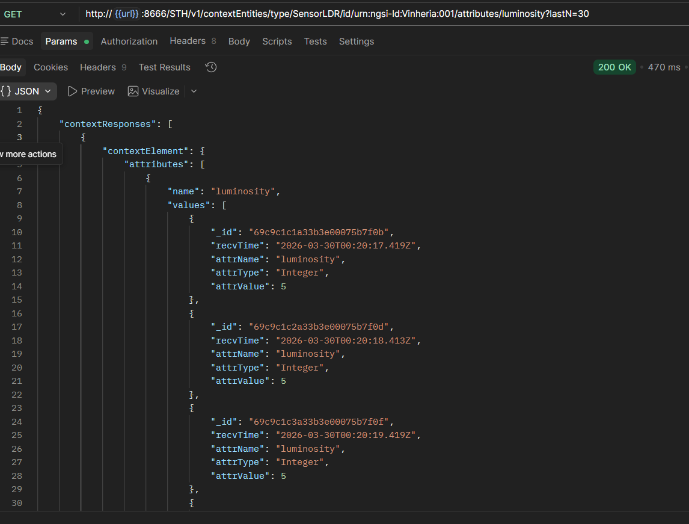

# CP4 — IoT Vinheria Agnello

> Solução IoT com ESP32 e sensor LDR integrada ao FIWARE para monitoramento de luminosidade da Vinheria Agnello — CP4 FIAP 2026

## Integrantes

| Nome | RM |
|------|----|
| João Victor Melo | 566640 |
| Gustavo Macedo | 567594 |
| Gustavo Hiruo | 567625 |
| Yan Lucas | 567046 |

**Turma:** 1ESPA  
**Professor:** Fábio Henrique Cabrini  
**Instituição:** FIAP — 2026

---

## Sobre o Projeto

A Vinheria Agnello necessita de monitoramento preciso das condições ambientais para garantir a qualidade dos seus produtos. Esta solução utiliza um **ESP32 DEVKIT V1** equipado com um **sensor LDR** para capturar dados de luminosidade em tempo real e enviá-los à plataforma **FIWARE** via protocolo **MQTT**.

A partir do FIWARE, é possível:
- Monitorar remotamente a luminosidade do ambiente
- Ligar e desligar o LED onboard do ESP32 via comandos MQTT (cloud → edge)
- Armazenar o histórico dos dados de luminosidade via STH-Comet
- Consultar o estado atual do dispositivo via Orion Context Broker

---

## Arquitetura

```
ESP32 + LDR
     │
     │ MQTT (porta 1883)
     ▼
Eclipse Mosquitto (Broker MQTT)
     │
     ▼
IoT Agent MQTT (porta 4041)
     │
     ▼
Orion Context Broker (porta 1026)
     │
     ▼
STH-Comet (porta 8666) — Histórico de dados
     │
MongoDB — Banco de dados
```

Todos os componentes FIWARE estão hospedados em uma VM Ubuntu no **Microsoft Azure** (`20.124.178.183`).



---

## Componentes FIWARE Utilizados

| Componente | Função | Porta |
|-----------|--------|-------|
| Orion Context Broker | Gerenciamento de entidades e dados contextuais | 1026 |
| IoT Agent MQTT | Integração dos dispositivos IoT via MQTT | 4041 |
| STH-Comet | Armazenamento histórico de dados (time series) | 8666 |
| Eclipse Mosquitto | Broker MQTT | 1883 |
| MongoDB | Banco de dados NoSQL | 27017 |

---

## Entidade FIWARE

O dispositivo foi registrado no FIWARE com o seguinte ID:
```
urn:ngsi-ld:Vinheria:001
```

- **Device ID:** `vinheria001`
- **Entity Type:** `SensorLDR`

### Tópicos MQTT

| Tópico | Descrição |
|--------|-----------|
| `/TEF/vinheria001/cmd` | Recebe comandos (ligar/desligar LED) |
| `/TEF/vinheria001/attrs` | Publica o status do LED |
| `/TEF/vinheria001/attrs/l` | Publica o valor de luminosidade |

---

## Circuito



O sensor LDR está conectado ao **pino analógico 34** do ESP32. O valor lido é mapeado de 0–4095 para 0–100 e publicado no broker MQTT.

---

## Simulação no Wokwi

Acesse a simulação completa do projeto no link abaixo:

🔗 [Simulação no Wokwi](https://wokwi.com/projects/459869980812560385)



---

## Vídeo Demonstrativo

> **[LINK DO VÍDEO AQUI]** — Vídeo demonstrando o funcionamento no Wokwi e os comandos via Postman.

---

## Operação via Postman

As operações foram realizadas utilizando a [collection oficial do FIWARE Descomplicado](https://github.com/fabiocabrini/fiware).

### Operações demonstradas:

- **Provisionar dispositivo** no IoT Agent MQTT
- **Registrar entidade** no Orion Context Broker
- **Enviar comando `on`** — liga o LED onboard do ESP32
- **Enviar comando `off`** — desliga o LED onboard do ESP32
- **Consultar luminosidade** — busca o valor atual no Orion
- **Consultar histórico** — busca os dados armazenados no STH-Comet







---

## Como Executar

### Pré-requisitos

- VM com Ubuntu Server rodando o [FIWARE Descomplicado](https://github.com/fabiocabrini/fiware)
- Portas `1026`, `1883`, `4041` e `8666` liberadas no firewall
- Arduino IDE com as bibliotecas `WiFi.h` e `PubSubClient` instaladas
- Postman com a collection do FIWARE Descomplicado importada

### Passos

1. Clone este repositório
2. Abra o arquivo `vinheria_agnello.ino` na Arduino IDE
3. Ajuste o `SSID`, `PASSWORD` e o IP do broker conforme seu ambiente
4. Faça o upload para o ESP32 (ou use a simulação no Wokwi)
5. No Postman, provisione o dispositivo e registre a entidade no FIWARE
6. Envie comandos e monitore os dados via Orion e STH-Comet

---

## Adaptações Realizadas

O projeto foi baseado na PoC Smart Lamp do [FIWARE Descomplicado](https://github.com/fabiocabrini/fiware), com as seguintes adaptações para o contexto da Vinheria Agnello:

- `device_id` alterado de `lamp001` para `vinheria001`
- `entity_name` alterado de `urn:ngsi-ld:Lamp:001` para `urn:ngsi-ld:Vinheria:001`
- `entity_type` alterado de `Lamp` para `SensorLDR`, refletindo o sensor utilizado no projeto
- Tópicos MQTT alterados de `/TEF/lamp001/` para `/TEF/vinheria001/`
- Descrição do registro alterada de `Lamp Commands` para `Vinheria Commands`
- Subscrição do STH-Comet atualizada para monitorar a entidade `urn:ngsi-ld:Vinheria:001` do tipo `SensorLDR`
- O cabeçalho do código `.ino` foi atualizado com os autores originais e os integrantes do grupo
- A rede Wi-Fi foi configurada para `Wokwi-GUEST` na simulação e `FIAP-IOT` no ESP32 físico

---

## Referências

- [FIWARE Descomplicado — Prof. Fábio Cabrini](https://github.com/fabiocabrini/fiware)
- [Documentação do Orion Context Broker](https://fiware-orion.readthedocs.io/en/3.10.1/index.html)
- [Documentação do STH-Comet](https://fiware-sth-comet.readthedocs.io/en/latest/)
- [Documentação do IoT Agent MQTT](https://github.com/FIWARE/tutorials.IoT-Agent)
- [Smart Data Models — FIWARE](https://github.com/smart-data-models)
- [Simulação no Wokwi](https://wokwi.com/projects/459869980812560385)